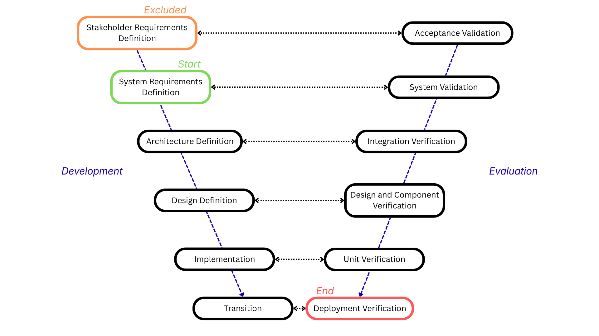

# SDLC Phases Aligned with IEEE 12207 and Structured Through a V-Model

## Table of Contents

1. [Experimental Boundaries](#experimental-boundaries)
2. [V-Model Structure](#v-model-structure)
3. [Development Side (System Definition)](#development-side-system-definition)

    - [1. Stakeholder Requirements Definition](#1-stakeholder-requirements-definition)
    - [2. System Requirements Definition](#2-system-requirements-definition)
    - [3. Architecture Definition](#3-architecture-definition)
    - [4. Design Definition](#4-design-definition)
    - [5. Implementation](#5-implementation)

4. [Evaluation Side (Verification and Validation)](#evaluation-side-verification-and-validation)

    - [6. Verification](#6-verification)
    - [7. Validation](#7-validation)
    - [8. Transition](#8-transition)

5. [V-Model Guarantees](#v-model-guarantees)

---

This document defines the Software Development Lifecycle (SDLC) structure applied in this research.  
The lifecycle is derived from ISO/IEC/IEEE 12207 (Systems and Software Engineering: Software Life Cycle Processes) and is operationalized using a V-Model structure to ensure systematic refinement, bidirectional traceability, and structured evaluation of artifacts.

The SDLC is organized into eight sequential and traceable phases:

1. Stakeholder Requirements Definition  
2. System Requirements Definition  
3. Architecture Definition  
4. Design Definition  
5. Implementation  
6. Verification  
7. Validation  
8. Transition  

Each phase transforms its input into a more concrete and operational representation. The output of one phase forms the controlled baseline for the next phase. This ensures continuity, traceability, and controlled refinement across the lifecycle.

---

## Experimental Boundaries

### Participant assignment and order effects

The same individual conducts both approach runs for a given project. This eliminates between-person skill variance as a confound in the cross-approach comparison, at the cost of introducing potential learning effects: a participant who completes the human-orchestrated run first may have stronger domain familiarity when supervising the autonomous pipeline run.

To mitigate this, run order is fixed as Approach 1 then Approach 2. This ordering is deliberate. The first run establishes the manually orchestrated baseline, and the second run evaluates autonomous execution under equivalent SDLC artifacts and constraints.

A separate project (project 2) is used to assess cross-project generalizability. The same participant and the same fixed order apply.

### Pre-experiment (excluded from the time budget)

The experiment time budget is **24 hours of active working time**, structured as three working days of eight hours each with no active work outside those periods. Calendar time between sessions is not counted. Each session is recorded as a row in the `sessions` table in the experiment database, opened at the start of the session and closed at its end. The three session rows together constitute the verifiable evidence of the session boundary rule; a gap in interaction log timestamps is circumstantial, whereas the session records are the authoritative account. The run-level `started_at` and `ended_at` fields in the `runs` table reflect the overall run span; per-session timestamps are in `sessions`.

Two categories of work are performed before the time budget opens and are excluded from all time and effort measurements.

**Phase 1 (Stakeholder Requirements Definition)** is conducted once per project by the human overseer. Requirements are validated and approved before any approach begins. Excluding Phase 1 ensures that both approaches start from an identical, frozen input baseline, preventing requirements quality from becoming a confound in the comparison.

**Baseline environment setup** covers the minimal, project-independent infrastructure required to begin any development work:

- Version control repository initialised with a basic project skeleton.
- Language runtime and dependency management tooling configured.
- A general CI skeleton (push → build → run tests) in place but not yet connected to any project-specific tests or deployment targets.

Nothing project-specific is pre-configured. The integration of CI/CD with the actual codebase, writing of deployment scripts, environment variable configuration, and all packaging work specific to the project are **in-experiment tasks**. This boundary is intentional: in Approach 2 the automated pipeline is expected to generate this project-specific tooling autonomously, while in Approach 1 the human orchestrator remains in active control of each interaction. That difference is a research finding, not overhead to be eliminated before the clock starts.

### In-experiment (within the 24-hour measurement)

All work performed during the 24-hour window is measured, regardless of how it is done, whether by AI, by automated tooling, or directly by the human without any AI assistance. This includes:

- All SDLC Phases 2–8 and all project-specific CI/CD and deployment configuration they entail.
- All AI interactions, logged via the prompt log.
- All manual work performed outside direct AI responses, logged as `manual_edit` interventions with a `time_spent_minutes` value in the `interventions` table. This remains a key observable in Approach 1.

### When time expires

When the 24-hour window closes, the active phase is recorded as the terminal phase for that approach run. Work in progress is committed as-is with a protocol termination note. No further work is performed on that run. Not every approach will reach Phase 8. The set of phases completed within the time budget is one of the primary comparative findings of the study. See the [Phase reach rate](metrics.md#phase-reach-rate) metric.

---

## V-Model Structure

The SDLC is structured according to a V-Model consisting of two logically related sides:

- The development side (system definition)
- The evaluation side (verification and validation)

The development side refines intent into progressively more technical and concrete artifacts.  
The evaluation side examines those artifacts against their originating specifications at equivalent abstraction levels.

The alignment between development and evaluation activities is structured as follows:

| Development Phase                    | Evaluation Activity                  |
| ------------------------------------ | ------------------------------------ |
| Stakeholder Requirements Definition  | Acceptance Validation                |
| System Requirements Definition       | System Validation                    |
| Architecture Definition              | Integration Verification             |
| Design Definition                    | Design and Component Verification    |
| Implementation                       | Unit Verification                    |

This alignment ensures that evaluation activities are derived directly from defined development artifacts. No evaluation activity is defined independently of its originating specification.

---

## Development Side (System Definition)

### 1. Stakeholder Requirements Definition

> **Experimental scope note:** This phase is conducted once per project by the human overseer, prior to and independently of all timed experiment runs. It is excluded from the time budget applied to Phases 2–8. The approved Stakeholder Requirements Specification produced here serves as the common, frozen baseline for both approaches of a given project.

Stakeholder Requirements Definition formalizes stakeholder intent into a structured set of stakeholder requirements. This phase defines why the system exists, what objectives it must fulfill, and under which business, regulatory, operational, and environmental constraints it must operate.

Stakeholder inputs may include client interviews and notes, workshops, contractual documents, regulatory texts, domain analyses, and exploratory discussions. These inputs are analyzed to identify explicit and implicit expectations. The system boundary is defined to clearly distinguish in-scope from out-of-scope elements.

Stakeholder requirements are expressed in a solution-independent manner. They describe expected capabilities and constraints without prescribing technical realization.

#### Requirement Quality Criteria

Each stakeholder requirement must satisfy five quality attributes: atomic, unambiguous, testable, consistent, and feasible. Definitions, examples, and the full requirement template are in [`requirements.md`](requirements.md).

#### Outputs

- Stakeholder Requirements Specification (StRS)  
- Defined acceptance criteria  
- Unique identification scheme  
- Traceability matrix initialization  

#### Phase exit criteria

This phase is complete when all requirements have been validated against the five quality attributes, all requirements carry a unique REQ-NN identifier, and no stakeholder requirement remains without a defined acceptance criterion. The complete set is approved by the human overseer before any approach begins.

---

### 2. System Requirements Definition

System Requirements Definition translates stakeholder requirements into a complete and technically precise set of system-level requirements.

This phase refines external expectations into observable system behavior, performance characteristics, interface definitions, and operational constraints.

System requirements are structured into:

- Functional requirements  
- Non-functional requirements  
- Interface requirements  
- Environmental and operational constraints  

Each system requirement is explicitly traceable to one or more stakeholder requirements. Traceability relationships are maintained in a formal matrix.

System requirements must satisfy the same quality attributes defined previously: atomicity, unambiguity, measurability, consistency, and feasibility.

#### Artifact Template

System requirements follow the same structured format as stakeholder requirements. The formal template is maintained in the [`requirements.md`](requirements.md) file.

#### Outputs

- System Requirements Specification (SyRS)  
- Stakeholder-to-system traceability mappings  
- System validation criteria  

#### Phase exit criteria

This phase is complete when every stakeholder requirement is addressed by at least one system requirement, all system requirements carry a unique REQ-NN identifier, and the stakeholder-to-system traceability matrix has no gaps. The requirement-to-design linkage rate is not yet required here but must reach 100% before Phase 6 begins.

---

### 3. Architecture Definition

Architecture Definition establishes the high-level structural organization of the system. System requirements are allocated to architectural components.

Architectural definition includes:

- Identification of subsystems and components  
- Allocation of system requirements  
- Definition of interfaces  
- Selection of architectural patterns  
- Documentation of assumptions and constraints  

Architecture Definition produces a structural baseline against which integration verification will later be conducted.

#### Artifact Templates

Architecture artifacts follow structured formats defined in the [`architecture.md`](architecture.md) file (inspired by the C4 model (Brown, 2018) for component decomposition and the ADR format (Nygard, 2011) for decision recording). Two artifact types are defined: the Architecture Note and the Architectural Decision Record.

#### Outputs

- Architecture description document  
- Interface specifications  
- Requirement allocation matrix  
- Architectural decision records  

#### Phase exit criteria

This phase is complete when every system requirement is allocated to at least one architectural component (requirement allocation rate = 100%), every declared component interface has a corresponding specification, the component dependency graph contains no cycles, and at least one ADR has been recorded for each non-trivial structural decision. A requirement allocation rate below 100% is a blocking defect.

---

### 4. Design Definition

Design Definition refines architectural components into detailed technical specifications sufficient for implementation.

This includes:

- Component-level behavioral definitions  
- Data structures and schemas  
- Algorithm specifications  
- API contracts  
- Error handling mechanisms  

Design Definition establishes the baseline for design and component verification.

#### Artifact Template

Design artifacts follow the structured format defined in the [`design.md`](design.md) file (grounded in IEEE 1016-2009).

#### Outputs

- Detailed design documentation  
- Interface contracts  
- Data models  
- Component specifications  

#### Phase exit criteria

This phase is complete when every architectural component has at least one corresponding design specification (DSGN-NN), every declared interface appears in at least one design document with a complete contract, and all design specifications are traceable to their upstream architecture note.

---

### 5. Implementation

Implementation transforms design specifications into executable system elements.

Activities include:

- Source code development  
- Interface realization  
- Build configuration  
- Internal documentation  
- Preparation of unit verification artifacts  

Implementation produces the executable baseline that enters structured evaluation on the evaluation side of the V-Model.

#### Artifact Template

Implementation artifacts follow the structured format defined in the [`implementation.md`](implementation.md) file (grounded in ISO/IEC/IEEE 12207:2017 §6.4.7).

#### Outputs

- Source code  
- Executable artifacts  
- Configuration files  
- Unit verification artifacts  

#### Phase exit criteria

This phase is complete when every design specification (DSGN-NN) has at least one corresponding implementation unit (IMPL-NN), all implementation units compile and pass any automated build checks, and every IMPL-NN is traceable to its originating DSGN-NN. Implementation units that do not pass the build are not considered accepted artifacts.

---

## Evaluation Side (Verification and Validation)

### 6. Verification

Verification evaluates whether development artifacts conform to their defined specifications. It assesses correctness relative to defined baselines.

Verification activities include:

- Unit Verification against Design Definition  
- Design and Component Verification against Architecture Definition  
- Integration Verification against Architecture Definition and interface specifications  

Verification may involve testing, inspection, formal review, or analytical techniques. All verification artifacts maintain traceability to development artifacts.

#### Artifact Templates

Verification artifacts follow the structured formats defined in the [`verification.md`](verification.md) file (grounded in ISO/IEC 29119-3:2021). Two artifact types are defined: the Test Case and the Verification Completion Report.

#### Outputs

- Test Cases  
- Verification Completion Reports  
- Coverage analysis  
- Anomaly records  

#### Phase exit criteria

This phase is complete when all implementation units have at least one associated test case (VER-NN), a Verification Completion Report (VCR-NN) has been produced for each implementation unit, and the requirement-to-test linkage rate reaches 100%. All test cases must have been executed: a `Not run` status is not acceptable at phase close. Open `Fail` anomalies must either be resolved or formally recorded as known defects carried forward.

---

### 7. Validation

Validation evaluates whether the system fulfills defined requirements and stakeholder intent within its operational context.

Validation activities include:

- System Validation against the System Requirements Specification  
- Acceptance Validation against the Stakeholder Requirements Specification  
- Operational scenario execution  
- Stakeholder evaluation sessions  

Validation establishes fitness for purpose and readiness for transition.

#### Artifact Template

Validation artifacts follow the structured format defined in the [`validation.md`](validation.md) file (grounded in ISO/IEC 12207:2017 §6.4.9).

#### Outputs

- Validation reports  
- Acceptance records  
- Requirement satisfaction evidence  

#### Phase exit criteria

This phase is complete when at least one validation record (VAL-NN) exists for each system requirement, every validation record has a result of `accepted` or `rejected` (no `not run` records at phase close), and the client or designated stakeholder has formally confirmed which requirements are satisfied. A requirement satisfaction rate below 100% does not block transition but must be documented as an open finding.

---

### 8. Transition

Transition moves the validated system into operational use.

Activities include:

- Deployment preparation  
- Environment configuration  
- Release packaging  
- Installation procedures  
- Operational handover  
- Final acceptance confirmation  

Transition marks the formal conclusion of the development lifecycle and the beginning of operational exploitation.

#### Artifact Template

Transition artifacts follow the structured format defined in the [`transition.md`](transition.md) file (grounded in ISO/IEC/IEEE 12207:2017 §6.4.10).

#### Outputs

- Deployment artifacts  
- Release documentation  
- Operational configuration records  
- Acceptance confirmation  

#### Phase exit criteria

This phase is complete when a Transition Record (TRANS-NN) has been produced with a status of `Accepted`, the client or designated stakeholder has confirmed acceptance in writing (name and date recorded in the Acceptance Confirmation field), and the accepted release has been tagged in version control. A deployment that was attempted but not accepted by the client is recorded with status `Deployed` and is not considered a completed phase.

---

## V-Model Guarantees

The structured V-Model ensures:

- Every development artifact is evaluated against its originating specification.  
- Evaluation activities are derived from development artifacts.  
- Detected defects can be traced to their originating phase.  
- Full bidirectional traceability is maintained from stakeholder intent to deployed system.  

This structure provides methodological rigor, controlled refinement, and evaluative coherence across the entire lifecycle.
